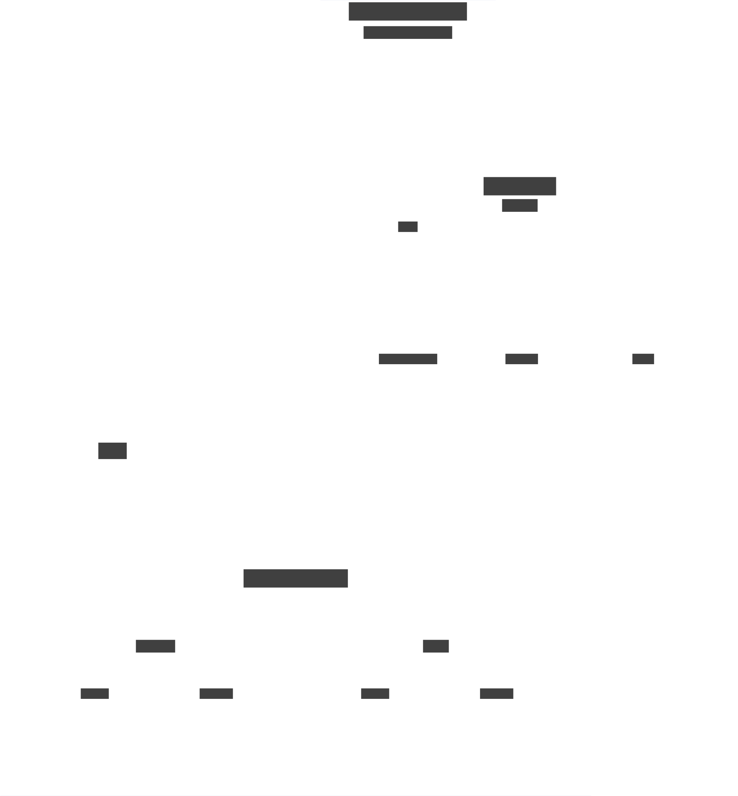

# Type Semantics

Type-Driven Development (TyDe) plays a fundamental role in my development approach, where program logic predominantly relies on type transformations. However, there are instances where broader type changes go beyond business logic, aiming to comply with implementation limitations.

Consequently, architectural patterns emerge in the realm of type conversions. To provide a visual representation of these patterns, please refer to the diagram below:

<figure > </img> <figcaption > </figcaption> </figure>
