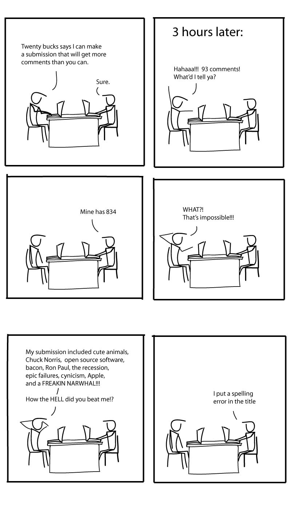

# Introduction
You are probably asking yourself, what is `SoapBerry` and How does it fit my stack? 

Well for now, SoapBerry is a set a crates, making the foundation of a framework
for building event-first applications. 

For now, let me introduce this book.

<figure > </img> <figcaption > Randal Munroe, Attribution-NonCommercial 2.5 Generic (CC BY-NC 2.5)</figcaption> </figure>

## This Book

This is not a book. 

Well technincally, it uses `mdBook`.
But I mean how many books you know, are added and updated daily?... (I mean except for O'Reilly's _MEAP_ program).

Anyways. This Book contains two parts.
1. The [Usage](./usage.md) part.
  This is probably where you should go. This part explains everything related to the applications and libraries and crates. 
2. The [Development](./development.md) part.
  This part holds architectural documents, explanations and diagrams related to the development and inner-workings of the `SoapBerry` that cannot fit better elsewhere. (like for example docs.rs page of each crate or comments in their code base or example folders for them)

## Note on grammatical and spelling mistakes
Please note that English is not my native language.
So if you have seen any mistakes please [open an issue](https://github.com/amirography/soapberry/issues/new) or make a pull-request.
I will appreciate it! 

<figure > </img> <figcaption > TheDogHouseDiaries.com, Creative Commons Attribution-NonCommercial 4.0</figcaption> </figure>
